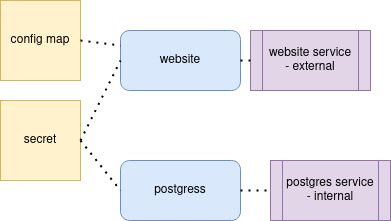

We need secret to keep our usernames and passwords of db
in `secret` we do not have plain text 
```azure
echo -n 'username' | base64
```
```azure
 kubectl apply -f postgres-secret.yaml
```
We need config map to store non-secure data
```azure
 kubectl apply -f postgres-configmap.yaml
```

Then we create components using following command
```azure
 kubectl apply -f postgres.yaml
```
We have to create image inside docker of minikube


This command connect you to docker inside the minikube
```azure
eval $(minikube docker-env)
```
And then we build our image there, using following command
```azure
 docker build -t my_website .
```

Then we create components using following command
```azure
 kubectl apply -f website.yaml
```


to enable external service and get node ip address
```azure
minikube service website-service
```
You can find the architecture here.

